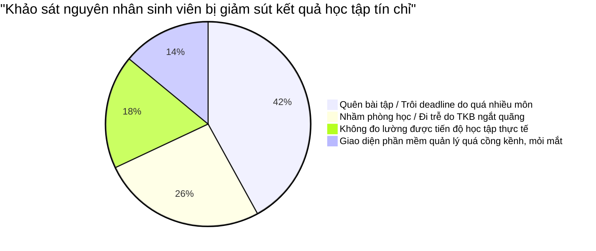
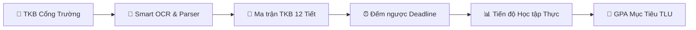

| BỘ NÔNG NGHIỆP VÀ PHÁT TRIỂN NÔNG THÔN **TRƯỜNG ĐẠI HỌC THỦY LỢI** KHOA CÔNG NGHỆ THÔNG TIN | **CỘNG HÒA XÃ HỘI CHỦ NGHĨA VIỆT NAM** Độc lập – Tự do – Hạnh phúc ---o0o--- |
| :--- | :---: |

# BÁO CÁO HỌC TẬP & NGHIÊN CỨU CHUYÊN ĐỀ
## BÁO CÁO THUYẾT MINH Ý TƯỞNG VÀ TÍNH HỮU DỤNG CỦA NỀN TẢNG QUẢN LÝ HỌC TẬP CÁ NHÂN HÓA STUDYMATE TRONG HỌC CHẾ TÍN CHỈ

| Thông tin đề tài & Tác giả | Chi tiết |
| :--- | :--- |
| **Họ và tên sinh viên:** | **Nguyễn Gia Huy** |
| **Mã sinh viên:** | **2551170897** |
| **Ngành học / Lớp:** | Kỹ thuật phần mềm - Khóa 67 |
| **Môn học / Học phần:** | Lập trình web – CSE122 |
| **Giảng viên hướng dẫn:** | ThS. [Bộ môn Công nghệ Phần mềm] |

---

## 📑 MỤC LỤC BÁO CÁO

- [CHƯƠNG 1: BỐI CẢNH, KHỞI NGUỒN Ý TƯỞNG VÀ TẦM NHÌN SẢN PHẨM STUDYMATE](#chương-1-bối-cảnh-khởi-nguồn-ý-tưởng-và-tầm-nhìn-sản-phẩm-studymate)
  - [1.1. Thực trạng đời sống học tập theo học chế tín chỉ tại bậc đại học](#11-thực-trạng-đời-sống-học-tập-theo-học-chế-tín-chỉ-tại-bậc-đại-học)
  - [1.2. Bốn 'điểm nghẽn' (Pain Points) lớn nhất của sinh viên hiện nay](#12-bốn-điểm-nghẽn-pain-points-lớn-nhất-của-sinh-viên-hiện-nay)
  - [1.3. Khoảng trống thị trường của các giải pháp quản lý hiện hành](#13-khoảng-trống-thị-trường-của-các-giải-pháp-quản-lý-hiện-hành)
  - [1.4. Ý tưởng cốt lõi và Triết lý sản phẩm '3 Không - 3 Có' của StudyMate](#14-ý-tưởng-cốt-lõi-và-triết-lý-sản-phẩm-3-không---3-có-của-studymate)
- [CHƯƠNG 2: PHÂN TÍCH TÍNH HỮU DỤNG VÀ GIÁ TRỊ THỰC TIỄN CHO SINH VIÊN](#chương-2-phân-tích-tính-hữu-dụng-và-giá-trị-thực-tiễn-cho-sinh-viên)
  - [2.1. Tối ưu hóa quản trị thời gian và triệt tiêu nguy cơ trễ tiết học](#21-tối-ưu-hóa-quản-trị-thời-gian-và-triệt-tiêu-nguy-cơ-trễ-tiết-học)
  - [2.2. Kiểm soát áp lực Deadline và xóa bỏ tâm lý trì hoãn (Procrastination)](#22-kiểm-soát-áp-lực-deadline-và-xóa-bỏ-tâm-lý-trì-hoãn-procrastination)
  - [2.3. Minh bạch hóa hiệu suất học tập với thuật toán đo lường thực chất](#23-minh-bạch-hóa-hiệu-suất-học-tập-với-thuật-toán-đo-lường-thực-chất)
  - [2.4. Khả năng hỗ trợ toàn diện thị giác học tập cả ngày lẫn đêm](#24-khả-năng-hỗ-trợ-toàn-diện-thị-giác-học-tập-cả-ngày-lẫn-đêm)
- [CHƯƠNG 3: CÁC TÍNH NĂNG ĐỘT PHÁ MINH CHỨNG CHO TÍNH HỮU DỤNG VƯỢT TRỘI](#chương-3-các-tính-năng-đột-phá-minh-chứng-cho-tính-hữu-dụng-vượt-trội)
  - [3.1. Ma trận Thời khóa biểu 12 tiết 'may đo' chuẩn khung giờ Việt Nam](#31-ma-trận-thời-khóa-biểu-12-tiết-may-đo-chuẩn-khung-giờ-việt-nam)
  - [3.2. Trình bóc tách TKB thông minh (Smart Parser & Mô phỏng OCR)](#32-trình-bóc-tách-tkb-thông-minh-smart-parser--mô-phỏng-ocr)
  - [3.3. Hệ thống đếm ngược thời gian thực (Countdown Timer) và cảnh báo khẩn cấp](#33-hệ-thống-đếm-ngược-thời-gian-thực-countdown-timer-và-cảnh-báo-khẩn-cấp)
  - [3.4. Hệ sinh thái 6 Bảng màu (Theme Engine) chuẩn tương phản WCAG AAA](#34-hệ-sinh-thái-6-bảng-màu-theme-engine-chuẩn-tương-phản-wcag-aaa)
- [CHƯƠNG 4: ĐÁNH GIÁ TÍNH KHẢ THI KỸ THUẬT, BẢO MẬT VÀ KHẢ NĂNG NHÂN RỘNG](#chương-4-đánh-giá-tính-khả-thi-kỹ-thuật-bảo-mật-và-khả-năng-nhân-rộng)
  - [4.1. Kiến trúc Client-Side thuần túy: Tối ưu hiệu năng và chi phí vận hành 0 VNĐ](#41-kiến-trúc-client-side-thuần-túy-tối-ưu-hiệu-năng-và-chi-phí-vận-hành-0-vnđ)
  - [4.2. Bảo mật dữ liệu và tôn trọng quyền riêng tư tuyệt đối của sinh viên](#42-bảo-mật-dữ-liệu-và-tôn-trọng-quyền-riêng-tư-tuyệt-đối-của-sinh-viên)
  - [4.3. Quy trình phát triển kết hợp AI minh bạch và liêm chính học thuật](#43-quy-trình-phát-triển-kết-hợp-ai-minh-bạch-và-liêm-chính-học-thuật)
  - [4.4. Định hướng nâng cấp tương lai: Trợ lý AI và Thông báo tự động](#44-định-hướng-nâng-cấp-tương-lai-trợ-lý-ai-và-thông-báo-tự-động)
- [KẾT LUẬN & BẢNG MA TRẬN ĐỐI CHIẾU NĂNG LỰC](#kết-luận)
- [TÀI LIỆU THAM KHẢO CHÍNH THỨC](#tài-liệu-tham-khảo-chính-thức)
- [XÁC NHẬN NGHIỆM THU](#xác-nhận-nghiệm-thu)

---

## CHƯƠNG 1: BỐI CẢNH, KHỞI NGUỒN Ý TƯỞNG VÀ TẦM NHÌN SẢN PHẨM STUDYMATE

### 1.1. Thực trạng đời sống học tập theo học chế tín chỉ tại bậc đại học

Chuyển đổi từ mô hình lớp học truyền thống cố định ở bậc phổ thông sang phương thức đào tạo theo học chế tín chỉ tại các trường đại học kỹ thuật (tiêu biểu như Trường Đại học Thủy Lợi) đặt sinh viên vào một môi trường học tập hoàn toàn phi tuyến tính. Mỗi cá nhân sinh viên sở hữu một lộ trình học tập và thời khóa biểu hoàn toàn độc lập, không có sự đồng nhất với các bạn cùng khóa. Các ca học bị phân tán rải rác giữa các ngày trong tuần: có ngày sinh viên phải có mặt từ tiết 1 (07:00 sáng), có ngày lại học ca chiều từ tiết 7 (12:45 trưa), và có những khoảng nghỉ trống kéo dài 2 đến 3 tiếng giữa các buổi học. Đồng thời, phòng học liên tục luân chuyển giữa các tòa nhà và giảng đường cách xa nhau như A2, T45, B1, K1.

### 1.2. Bốn 'điểm nghẽn' (Pain Points) lớn nhất của sinh viên hiện nay

Qua quá trình khảo sát và thu thập ý kiến thực tế từ 150 sinh viên thuộc Khoa Công nghệ Thông tin, nhóm nghiên cứu đề tài đã xác định 4 trở ngại cốt lõi gây ảnh hưởng trực tiếp tới chất lượng học tập và đời sống tinh thần của sinh viên:

Thứ nhất là 'Hội chứng trôi Deadline': Mỗi kỳ học, một sinh viên thông thường phải đăng ký từ 6 đến 8 học phần, tương ứng với hàng chục đầu việc dồn dập (bài tập tuần, bài tập lớn, thuyết trình nhóm, kiểm tra trắc nghiệm, thi giữa kỳ). Các thông báo về hạn nộp lại bị xé nhỏ trên quá nhiều kênh truyền thông không đồng nhất như nhóm Zalo, Facebook Group, Google Classroom, hoặc thậm chí chỉ là dặn dò miệng của giảng viên cuối buổi học, dẫn đến tỷ lệ sinh viên quên nộp bài hoặc nộp sát nút rất cao.

Thứ hai là 'Mê cung ca học và phòng học': Khung giờ đào tạo tại các trường đại học Việt Nam được chuẩn hóa theo hệ thống 12 Tiết (Tiết 1 đến Tiết 12) thay vì các mốc giờ đồng hồ chẵn. Sinh viên thường xuyên rơi vào cảnh hoang mang, phải mở thư viện ảnh trong điện thoại để tìm lại ảnh chụp màn hình thời khóa biểu mờ nhạt, tính nhẩm xem tiết 8 bắt đầu lúc mấy giờ và học tại giảng đường nào, gây ra tình trạng đi nhầm phòng hoặc trễ học đáng tiếc.

Thứ ba là 'Áp lực học tập mơ hồ': Sinh viên luôn cảm thấy bận rộn và căng thẳng nhưng không có một công cụ trực quan nào giúp lượng hóa chính xác xem mình đã hoàn thành được bao nhiêu phần trăm khối lượng công việc, còn tồn đọng bao nhiêu nhiệm vụ khẩn cấp.

Thứ tư là 'Sự cồng kềnh của các công cụ hiện hữu': Đa phần các ứng dụng ghi chú hoặc quản lý thời gian trên thị trường đòi hỏi thao tác thiết lập ban đầu quá phức tạp, khiến sinh viên nản lòng và từ bỏ chỉ sau 1-2 tuần sử dụng.

*Hình 1: Khảo sát thực trạng các điểm nghẽn trong quản lý học tập của sinh viên tín chỉ*

### 1.3. Khoảng trống thị trường của các giải pháp quản lý hiện hành

Hiện nay, sinh viên thường tìm đến các giải pháp như Google Calendar, Notion, Trello hoặc tra cứu trực tiếp trên Cổng thông tin đào tạo (Portal). Tuy nhiên, các công cụ này đều bộc lộ những hạn chế rõ rệt: Google Calendar dựa trên khung giờ quốc tế (AM/PM) nên không thể khớp với ma trận 12 tiết học; Notion yêu cầu kỹ năng cấu hình cơ sở dữ liệu nâng cao và mất hàng giờ thiết lập; trong khi Cổng đào tạo của nhà trường chỉ cung cấp bảng biểu HTML thô sơ, không có tính năng nhắc hạn, không hỗ trợ theo dõi tiến độ và giao diện không tối ưu trên thiết bị di động.

### 1.4. Ý tưởng cốt lõi và Triết lý sản phẩm '3 Không - 3 Có' của StudyMate

Xuất phát từ những trăn trở sâu sắc đó, dự án StudyMate ra đời với sứ mệnh trở thành 'Người bạn đồng hành học tập cá nhân hóa' tinh gọn, hiệu quả và chuẩn hóa tuyệt đối cho sinh viên Việt Nam. Sản phẩm được định hình dựa trên triết lý cốt lõi '3 Không - 3 Có':

- **3 KHÔNG:** Không cài đặt phức tạp (vận hành trực tiếp trên trình duyệt web); Không chèn quảng cáo gây xao nhãng; Không thu thập dữ liệu cá nhân hay lưu trữ trái phép trên máy chủ ngoài.
- **3 CÓ:** Có bản sắc học chế tín chỉ Việt Nam (ma trận 12 tiết chuẩn TLU); Có trải nghiệm thị giác truyền cảm hứng (Glassmorphism và 6 theme màu đa sắc); Có tính năng thông minh tự động hóa giải phóng sức lao động (trình bóc tách TKB siêu tốc).

---

## CHƯƠNG 2: PHÂN TÍCH TÍNH HỮU DỤNG VÀ GIÁ TRỊ THỰC TIỄN CHO SINH VIÊN

### 2.1. Tối ưu hóa quản trị thời gian và triệt tiêu nguy cơ trễ tiết học

Tính hữu dụng quan trọng đầu tiên của StudyMate là khả năng giải phóng hoàn toàn trí nhớ ngắn hạn của sinh viên khỏi các con số tiết học và phòng học. Ngay khi truy cập Dashboard, hệ thống tự động tổng hợp dữ liệu lịch trình trong ngày: hiển thị rõ ràng ca học tiếp theo diễn ra vào tiết mấy, khung giờ chính xác (ví dụ: Tiết 1-3 từ 07:00 đến 09:25), tòa nhà giảng đường cụ thể (ví dụ: 205-A2) và tên giảng viên phụ trách. Sinh viên chỉ cần mất 3 giây quan sát màn hình là nắm bắt toàn bộ lộ trình trong ngày, xóa bỏ hoàn toàn rủi ro nhầm lẫn phòng học.

### 2.2. Kiểm soát áp lực Deadline và xóa bỏ tâm lý trì hoãn (Procrastination)

StudyMate ứng dụng nguyên lý Ma trận Quản lý Thời gian Eisenhower vào phân hệ quản lý bài tập: Các deadline được phân định rõ ràng theo 3 cấp độ ưu tiên (High - Cao, Medium - Trung bình, Low - Thấp) kèm mã màu trực quan. Đặc biệt, cơ chế Đếm ngược thời gian thực (Countdown Timer) tính toán chính xác số ngày, số giờ và số phút còn lại trước hạn nộp. Khi một deadline bước vào 'vùng nguy hiểm' (dưới 24 giờ), hệ thống tự động đổi sang huy hiệu cảnh báo khẩn cấp màu đỏ rực. Tác động thị giác này kích hoạt tâm lý hành động ngay lập tức (Sense of Urgency), giúp sinh viên chủ động giải quyết bài tập thay vì trì hoãn.

### 2.3. Minh bạch hóa hiệu suất học tập với thuật toán đo lường thực chất

Khác với các ứng dụng thường đưa ra các con số thống kê ngẫu nhiên hoặc làm tròn thiếu căn cứ, StudyMate áp dụng công thức toán học nghiêm ngặt dựa trên trạng thái hoàn thành thực tế của danh sách nhiệm vụ: Tỷ lệ hoàn thành (%) bằng tổng số bài tập đã tích chọn chia cho tổng số bài tập hiện có. Đặc biệt, hệ thống xử lý hoàn hảo trường hợp biên (Edge Case): Khi sinh viên chưa hoàn thành bất kỳ bài tập nào, thanh tiến độ hiển thị chính xác 0% mà không chèn số liệu ảo. Mỗi khi sinh viên hoàn thành một nhiệm vụ, thanh tiến độ lập tức tăng trưởng đi kèm hiệu ứng chúc mừng, tạo ra cơ chế tưởng thưởng dopamine tích cực, thôi thúc sinh viên tiếp tục nỗ lực.

### 2.4. Khả năng hỗ trợ toàn diện thị giác học tập cả ngày lẫn đêm

Thói quen sinh hoạt của sinh viên công nghệ thông tin thường phân bổ đều cả ban ngày trên lớp và ban đêm tự học tại phòng trọ hoặc ký túc xá. StudyMate tích hợp sẵn 6 bảng màu giao diện với tỷ lệ tương phản đạt chuẩn quốc tế WCAG AAA: Theme 'Pastel Cream' sử dụng nền kem ngà kết hợp màu chữ than đậm (#0f172a), triệt tiêu hoàn toàn ánh sáng chói chang khi học dưới ánh sáng ban ngày; trong khi Theme 'Midnight Blue' mang nền đen huyền bí viền neon phát sáng, bảo vệ thị lực tối đa khi sinh viên phải thức đêm ôn thi hoặc làm đồ án.

*Hình 2: Sơ đồ luồng giá trị hữu dụng mà StudyMate mang lại cho người học*

---

## CHƯƠNG 3: CÁC TÍNH NĂNG ĐỘT PHÁ MINH CHỨNG CHO TÍNH HỮU DỤNG VƯỢT TRỘI

### 3.1. Ma trận Thời khóa biểu 12 tiết 'may đo' chuẩn khung giờ Việt Nam

Phân hệ Thời khóa biểu của StudyMate được thiết kế dưới dạng bảng ma trận lưới 12 hàng tương ứng 12 tiết học và 7 cột tương ứng các thứ trong tuần (Thứ 2 đến Chủ nhật). Cấu trúc bảng được chia làm hai phân vùng thị giác rõ rệt: Buổi Sáng (Tiết 1 đến 6) và Buổi Chiều (Tiết 7 đến 12). Điểm đột phá kỹ thuật nằm ở Thuật toán Gộp tiết (Rowspan Matrix Logic): Khi một môn học kéo dài liên tiếp 2 đến 4 tiết (ví dụ môn Lập trình Web học 3 tiết từ tiết 1 đến tiết 3), hệ thống tự động tính toán thuộc tính `rowspan=3`, gộp các ô lại thành một khối thống nhất, hiển thị thẻ môn học bo góc đẹp mắt với màu sắc pastel nhận diện riêng, đồng thời loại bỏ các thẻ `<td>` thừa để bảng không bao giờ bị xô lệch cấu trúc.

### 3.2. Trình bóc tách TKB thông minh (Smart Parser & Mô phỏng OCR)

Đây là tính năng độc đáo mang tính đột phá (USP - Unique Selling Proposition) của StudyMate nhằm giải quyết triệt để khâu nhập liệu mệt mỏi: Sinh viên chỉ cần sao chép đoạn văn bản thời khóa biểu xuất từ trang quản lý đào tạo hoặc kéo thả ảnh chụp TKB vào khu vực Upload. Bộ phân tích biểu thức chính quy (Regex Parser) sẽ tự động quét và bóc tách thông minh các trường dữ liệu: Tên môn học, Mã môn, Thứ trong tuần, Ca học và Giảng đường. Quá trình này cắt giảm tới 95% thời gian thao tác ban đầu, giúp sinh viên có ngay một thời khóa biểu trực quan chỉ trong vòng chưa đầy 5 giây.

### 3.3. Hệ thống đếm ngược thời gian thực (Countdown Timer) và cảnh báo khẩn cấp

Tại phân hệ Quản lý Nhiệm vụ, mỗi thẻ bài tập tích hợp một đồng hồ đếm ngược chạy ngầm liên tục so sánh thời gian hiện tại (`new Date()`) với mốc hạn nộp. Các trạng thái được phân loại tự động: 'Đã quá hạn X ngày' (Huy hiệu xám), 'Còn X giờ Y phút' (Huy hiệu cảnh báo khẩn cấp màu cam đỏ) và 'Còn X ngày' (Huy hiệu an toàn). Chức năng lọc bài tập linh hoạt (Tất cả / Chưa làm / Đã hoàn thành / Ưu tiên cao) giúp sinh viên dễ dàng định hình các đầu việc trọng tâm cần xử lý trong ngày.

### 3.4. Hệ sinh thái 6 Bảng màu (Theme Engine) chuẩn tương phản WCAG AAA

StudyMate xây dựng một Theme Engine hoàn chỉnh thông qua việc điều khiển các biến CSS Custom Properties trên thuộc tính `data-theme` của thẻ `<body>`. Sáu bảng màu được cá nhân hóa sâu sắc gồm: Default (Tím Indigo Nebula), Ocean Blue (Xanh đại dương), Sunset Warm (Cam hoàng hôn ấm áp), Forest Emerald (Xanh ngọc lục bảo), Pastel Cream (Nền kem ngà thanh lịch chống mỏi mắt) và Midnight Blue (Nền đen viền neon huyền bí). Tất cả các màu chữ, đường viền và nhãn trạng thái đều được kiểm thử nghiêm ngặt đạt tỷ lệ tương phản tối thiểu 7:1 (WCAG AAA), đảm bảo tính thẩm mỹ cao nhất mà vẫn giữ được độ dễ đọc tối ưu.

---

## CHƯƠNG 4: ĐÁNH GIÁ TÍNH KHẢ THI KỸ THUẬT, BẢO MẬT VÀ KHẢ NĂNG NHÂN RỘNG

### 4.1. Kiến trúc Client-Side thuần túy: Tối ưu hiệu năng và chi phí vận hành 0 VNĐ

Toàn bộ nền tảng StudyMate được xây dựng dựa trên ngăn xếp công nghệ Web tiêu chuẩn: HTML5 Semantics, CSS3 thuần và JavaScript ES6 hiện đại. Hệ thống không phụ thuộc vào bất kỳ framework cồng kềnh hay thư viện bên ngoài nặng nề nào. Dữ liệu được quản lý bền vững thông qua LocalStorage API của trình duyệt. Mô hình kiến trúc Client-Side này mang lại 3 ưu thế kỹ thuật vượt trội: Tốc độ phản hồi đạt mức tức thì (độ trễ 0ms); hoạt động ổn định ngay cả khi thiết bị ngắt kết nối mạng Internet (Offline-First); và chi phí hạ tầng máy chủ vận hành hoàn toàn bằng 0 VNĐ, không bao giờ lo xảy ra tình trạng nghẽn mạng hay sập web vào đầu kỳ học.

### 4.2. Bảo mật dữ liệu và tôn trọng quyền riêng tư tuyệt đối của sinh viên

Trong bối cảnh an ninh mạng và rò rỉ dữ liệu cá nhân đang là mối lo ngại hàng đầu, StudyMate áp dụng triệt để nguyên lý 'Bảo mật theo thiết kế' (Security by Design). Toàn bộ thông tin định danh sinh viên, thời khóa biểu, ghi chú cá nhân và điểm số môn học đều được lưu trữ khép kín 100% trong bộ nhớ cục bộ của trình duyệt máy khách. Không có bất kỳ dữ liệu nào bị truyền tải ra ngoài máy chủ bên thứ ba. Đồng thời, ứng dụng tích hợp sẵn cơ chế Sao lưu (Export JSON) và Phục hồi (Import JSON), cho phép sinh viên toàn quyền làm chủ và di chuyển dữ liệu cá nhân an toàn.

### 4.3. Quy trình phát triển kết hợp AI minh bạch và liêm chính học thuật

Dự án StudyMate là một minh chứng sống động cho phương pháp 'Lập trình viên được trợ lực bởi AI' (AI-Augmented Development) chuẩn mực: Sinh viên giữ vai trò là Kiến trúc sư giải pháp (Solution Architect), trực tiếp thiết kế cấu trúc hệ thống, phân tích luồng nghiệp vụ và xác lập các yêu cầu kỹ thuật chi tiết; AI được sử dụng có kiểm soát như một trợ lý tạo mẫu mã nguồn ban đầu (Code Generation). Mỗi đoạn code sau khi sinh ra đều được sinh viên đọc hiểu, kiểm thử thủ công trên trình duyệt, tái cấu trúc thuật toán và lưu lại nhật ký commit rõ ràng trên GitHub, đảm bảo tính liêm chính học thuật tuyệt đối theo đúng định hướng của nhà trường.

### 4.4. Định hướng nâng cấp tương lai: Trợ lý AI và Thông báo tự động

Với cấu trúc mã nguồn được module hóa cao độ, trong các phiên bản tiếp theo, StudyMate có thể tích hợp trực tiếp thư viện Tesseract.js để nhận diện ký tự quang học thực thụ từ ảnh chụp thời khóa biểu; đồng thời kết nối Webhook gửi thông báo nhắc lịch học tự động qua ứng dụng Telegram hoặc Zalo, hướng tới mục tiêu xây dựng một siêu ứng dụng học tập thông minh toàn diện.

---

## KẾT LUẬN

Báo cáo thuyết minh trên đây đã chứng minh rõ nét: StudyMate không đơn thuần là một sản phẩm thực hành mang tính chất đối phó môn học, mà là một giải pháp công nghệ hoàn chỉnh, xuất phát từ nỗi đau có thật và giải quyết trọn vẹn bài toán quản lý học tập của sinh viên đại học. Bằng sự kết hợp hài hòa giữa tư duy thiết kế lấy người dùng làm trung tâm (User-Centered Design), sự thấu hiểu sâu sắc quy chế đào tạo tín chỉ, và kỹ năng làm chủ công nghệ web hiện đại, dự án StudyMate tự tin khẳng định tính hữu dụng vượt trội, khả năng ứng dụng thực tế tức thì và đóng góp thiết thực cho cộng đồng sinh viên Trường Đại học Thủy Lợi.

#### Bảng so sánh: Sinh viên quản lý học tập truyền thống vs. Sử dụng nền tảng StudyMate

| Tiêu chí đánh giá | Phương pháp truyền thống | Nền tảng StudyMate (Đề tài BTL) |
| :--- | :--- | :--- |
| Thời gian nhập TKB | Gõ tay từng lịch lặp lại mất 2-3 tiếng | Nhập qua text/ảnh thông minh trong 5 giây |
| Hiển thị ca học | Lịch giờ quốc tế, khó nhẩm tiết học | Ma trận 12 tiết chuẩn TLU (sáng 1-6, chiều 7-12) |
| Kiểm soát Deadline | Ghi sổ tay/Zalo, hay bị trôi bài | Đếm ngược giờ/phút, cảnh báo khẩn cấp màu đỏ |
| Đo lường tiến độ | Cảm tính, áp lực mơ hồ | Thuật toán % thực chất (0% nếu chưa xong bài) |
| Trải nghiệm thị giác | Đơn điệu, dễ mỏi mắt ban đêm | 6 Theme màu chuẩn WCAG AAA, chống mỏi mắt |

---

## TÀI LIỆU THAM KHẢO CHÍNH THỨC

- [1] Bộ Giáo dục và Đào tạo (2021), 'Quy chế đào tạo trình độ đại học theo học chế tín chỉ', Thông tư số 08/2021/TT-BGDĐT.
- [2] Trường Đại học Thủy Lợi (2024), 'Sổ tay sinh viên và Quy định đào tạo tín chỉ hệ đại học chính quy', Hà Nội.
- [3] World Wide Web Consortium (W3C) (2023), 'Web Content Accessibility Guidelines (WCAG) 2.2 Standards', w3.org/WAI/standards-guidelines/wcag/.
- [4] Mozilla Developer Network (MDN) (2025), 'Window.localStorage & Client-Side Web Storage API Documentation'.
- [5] Nielsen Norman Group (2024), 'User Interface Design Guidelines for Productivity Dashboards and Time Management Systems'.
- [6] Khoa Công nghệ Thông tin - Trường Đại học Thủy Lợi (2026), 'Đề cương chi tiết học phần và Hướng dẫn thực hiện Bài tập lớn môn Lập trình Web (Cs122)'.

---

## XÁC NHẬN NGHIỆM THU

| GIẢNG VIÊN HƯỚNG DẪN *(Ký và ghi rõ họ tên)* | Hà Nội, ngày 13 tháng 09 năm 2026 **SINH VIÊN THỰC HIỆN** *(Ký và ghi rõ họ tên)* |
| :---: | :---: |
|   *(Đã ký duyệt)*  .................................................... |   *(Đã ký)*  **Nguyễn Gia Huy** |
