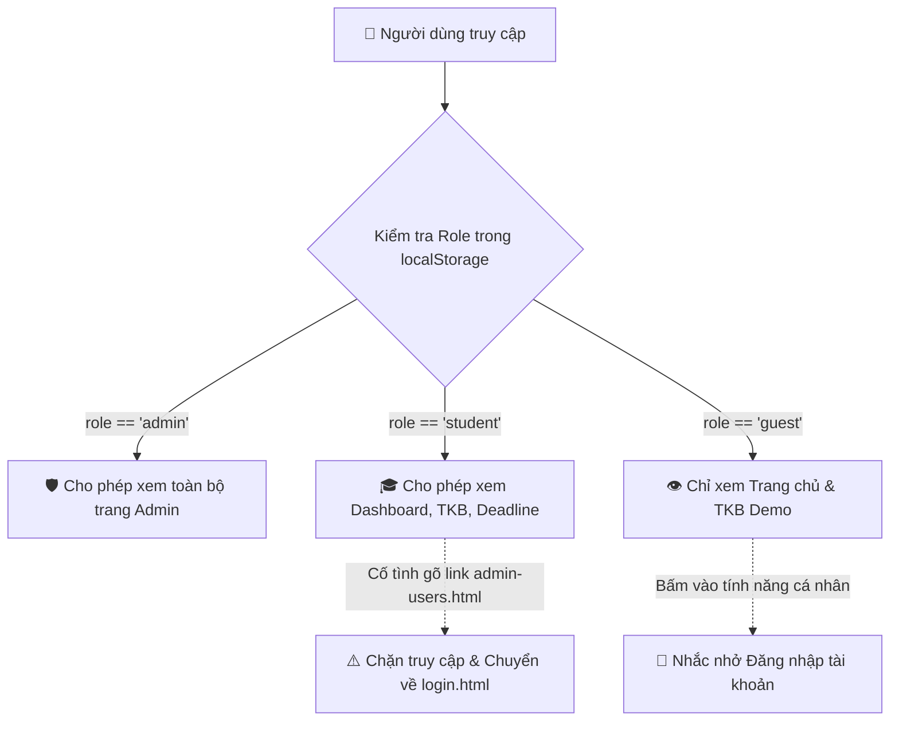

# 🛡️ ĐẶC TẢ Ý TƯỞNG & THIẾT KẾ PHÂN HỆ QUẢN TRỊ VIÊN (STUDYMATE ADMIN PORTAL)
> **Dự án:** StudyMate - Nền tảng Hỗ trợ Học tập & Quản lý Thời khóa biểu Cá nhân hóa cho Sinh viên  
> **Học phần:** Phát triển Ứng dụng Web (CSE122) – Trường Đại học Thủy Lợi (TLU)  
> **Tác giả:** Nguyễn Gia Huy – MSV: 2551170897 – Lớp: 67KTPM  
> **Ngày lập tài liệu:** 14/09/2026  

---

## 📑 MỤC LỤC TÀI LIỆU
1. [BỐI CẢNH & Ý NGHĨA CỦA PHÂN HỆ ADMIN](#1-bối-cảnh--ý-nghĩa-của-phân-hệ-admin)
2. [Ý TƯỞNG THIẾT KẾ GIAO DIỆN ĐĂNG NHẬP ADMIN (ADMIN LOGIN)](#2-ý-tưởng-thiết-kế-giao-diện-đăng-nhập-admin-admin-login)
3. [KIẾN TRÚC DỮ LIỆU LOCALSTORAGE PHÂN HỆ QUẢN TRỊ](#3-kiến-trúc-dữ-liệu-localstorage-phân-hệ-quản-trị)
4. [CÁC CHỨC NĂNG QUẢN TRỊ CỐT LÕI (CORE ADMIN MODULES)](#4-các-chức-năng-quản-trị-cốt-lõi-core-admin-modules)
5. [CƠ CHẾ BẢO MẬT & ĐIỀU HƯỚNG ROUTING (CLIENT-SIDE RBAC)](#5-cơ-chế-bảo-mật--điều-hướng-routing-client-side-rbac)
6. [KỊCH BẢN DEMO THUYẾT TRÌNH VỚI GIẢNG VIÊN CSE122](#6-kịch-bản-demo-thuyết-trình-với-giảng-viên-cse122)

---

## 1. BỐI CẢNH & Ý NGHĨA CỦA PHÂN HỆ ADMIN

### 1.1. Khái niệm phân hệ
Trong hệ sinh thái phần mềm StudyMate, hệ thống được chia làm hai phân vùng trải nghiệm:
- **Cổng Sinh viên (Student Portal):** Dành cho từng cá nhân sinh viên xem thời khóa biểu, theo dõi deadline, đếm ngược hạn nộp và tính toán GPA mục tiêu.
- **Cổng Quản trị (Admin Console):** Đóng vai trò tương đương **Ban Đào tạo & Văn phòng Khoa Công nghệ Thông tin**. Quản trị viên nắm giữ quyền kiểm soát hệ thống, quản lý danh sách sinh viên, giám sát số lượng tài khoản hoạt động, cấu hình danh mục môn học chung toàn trường và phát thông báo học vụ.

### 1.2. Giá trị đạt điểm cao trong học phần CSE122
- **Hoàn thiện mô hình Phân quyền RBAC (Role-Based Access Control):** Khách vãng lai (Guest) ➔ Sinh viên chính thức (Student) ➔ Quản trị viên hệ thống (Admin).
- **Đáp ứng tiêu chí CRUD bắt buộc:** Thể hiện trọn vẹn kỹ năng thao tác dữ liệu (Thêm, Xem, Sửa, Khóa/Mở, Xóa).
- **Tính thực tiễn cao:** Chứng minh đồ án là một phần mềm quản lý trường học thực thụ, không chỉ dừng lại ở giao diện tĩnh cho một cá nhân.

---

## 2. Ý TƯỞNG THIẾT KẾ GIAO DIỆN ĐĂNG NHẬP ADMIN (ADMIN LOGIN)

### 2.1. Phong cách thiết kế: Security Command Center
- **Tone màu chủ đạo:** Nền tối huyền bí (Dark Slate `#0b0f19` hoặc `#0f172a`), viền phát sáng Glassmorphism và màu điểm nhấn đỏ quyền lực (`#ef4444`) hoặc tím thẫm (`#8b5cf6`).
- **Logo & Huy hiệu nhận diện:** 
  - Biểu tượng khiên bảo mật: `🛡️ StudyMate Admin Console`.
  - Nhãn trạng thái: `Restricted Access • Authorized Personnel Only`.
- **Thông điệp cảnh báo an ninh:** *"Hệ thống kiểm soát truy cập Đào tạo TLU. Mọi phiên đăng nhập đều được lưu trữ nhật ký bảo mật."*

### 2.2. Các thành phần trên Form đăng nhập Admin
1. **Ô nhập Email / Tài khoản quản trị:** `admin@studymate.edu.vn` kèm icon bảo mật.
2. **Ô nhập Mật khẩu:** `••••••••` kèm icon con mắt 👁️ để bật/tắt ẩn/hiện mật khẩu.
3. **Mã xác thực bảo mật 2 lớp mô phỏng (Security PIN / Captcha):** Nhập mã 4 số bảo mật để gia tăng tính chuyên nghiệp.
4. **Nút "⚡ Điền nhanh tài khoản Admin mẫu" (1-Click Demo):** 
   - Hỗ trợ Giảng viên và người chấm bài bấm 1 click để tự động điền thông tin đăng nhập mà không cần nhớ mật khẩu.
5. **Hiệu ứng nút đăng nhập (Loading State):**
   - Khi bấm **"Truy cập Bảng điều khiển →"**, nút hiển thị spinner xoay nhẹ trong 0.8s mô phỏng quá trình xác thực danh tính trước khi chuyển hướng.
6. **Lối quay lại Cổng sinh viên:** `← Quay về Giao diện Sinh viên`.

### 2.3. Hai phương án kiến trúc giao diện
- **Phương án A (Tách trang riêng - Đề xuất):** Tạo tệp `pages/admin-login.html` riêng biệt, thể hiện rõ việc tách bạch giữa Client Portal và Admin Console.
- **Phương án B (Tích hợp Tab tại trang login cũ):** Cung cấp 2 Tab `🎓 Sinh viên` | `🛡️ Quản trị viên` ngay tại `pages/login.html`.

---

## 3. KIẾN TRÚC DỮ LIỆU LOCALSTORAGE PHÂN HỆ QUẢN TRỊ

### 3.1. Khóa lưu danh sách người dùng (`studymate_users_list`)
Dữ liệu sinh viên toàn trường được lưu trữ dạng mảng JSON trong `localStorage`:

```json
[
  {
    "id": "usr_2551170897",
    "mssv": "2551170897",
    "name": "Nguyễn Gia Huy",
    "class": "67KTPM",
    "email": "huy.ng2551170897@e.tlu.edu.vn",
    "role": "Sinh viên",
    "status": "active",
    "createdAt": "2026-09-01T08:00:00.000Z"
  },
  {
    "id": "usr_2251065678",
    "mssv": "2251065678",
    "name": "Trần Minh Đức",
    "class": "64CNTT2",
    "email": "duc.tm@studymate.edu.vn",
    "role": "Sinh viên",
    "status": "active",
    "createdAt": "2026-09-01T08:30:00.000Z"
  },
  {
    "id": "usr_2251069999",
    "mssv": "2251069999",
    "name": "Lê Thị Thu",
    "class": "67KTPM",
    "email": "thu.lt@studymate.edu.vn",
    "role": "Lớp trưởng",
    "status": "locked",
    "createdAt": "2026-09-02T09:00:00.000Z"
  },
  {
    "id": "usr_admin_01",
    "mssv": "ADMIN_TLU",
    "name": "Quản trị viên Hệ thống (Khoa CNTT)",
    "class": "Khoa CNTT",
    "email": "admin@studymate.edu.vn",
    "role": "Quản trị viên",
    "status": "active",
    "createdAt": "2026-08-15T00:00:00.000Z"
  }
]
```

### 3.2. Khóa phiên làm việc hiện tại (`studymate_user`)
Khi Admin đăng nhập thành công:
```json
{
  "id": "usr_admin_01",
  "studentId": "ADMIN_TLU",
  "fullName": "Quản trị viên Hệ thống (Khoa CNTT)",
  "email": "admin@studymate.edu.vn",
  "department": "Văn phòng Khoa Công nghệ Thông tin",
  "role": "admin"
}
```

---

## 4. CÁC CHỨC NĂNG QUẢN TRỊ CỐT LÕI (CORE ADMIN MODULES)

### 4.1. Module 1: Dashboard Báo cáo Thống kê (`admin-dashboard.html`)
- **4 Thẻ số liệu đếm thời gian thực (Real-time Metrics):**
  - Tổng số sinh viên đăng ký hệ thống.
  - Số tài khoản đang hoạt động bình thường (`active`).
  - Số tài khoản đang bị tạm khóa (`locked`).
  - Số lượng môn học trong danh mục toàn trường.
- **Biểu đồ tiến độ hoàn thành bài tập chung** của sinh viên.
- **Nhật ký thao tác gần đây (Activity Logs):** Thêm sinh viên, khóa tài khoản, cập nhật môn học.

### 4.2. Module 2: Quản lý Tài khoản & Phân quyền (`admin-users.html`)
- **Tìm kiếm tức thì (Real-time Search):** Gõ MSSV hoặc tên sinh viên -> lọc danh sách ngay trong 0.01s.
- **Lọc theo tiêu chí (Filter):** Lọc theo vai trò (Sinh viên / Lớp trưởng / Admin) và trạng thái (Hoạt động / Bị khóa).
- **Thao tác thêm sinh viên mới (Create User Modal):** Popup nhập MSSV, Tên, Lớp, Email, Phân quyền.
- **Khóa / Mở khóa 1-Click (Toggle Status):** Đổi màu badge từ Xanh lá (Hoạt động) sang Đỏ (Bị khóa).
- **Cấp quyền Lớp trưởng (Promote to Monitor):** Cho phép tài khoản có quyền đăng thông báo bài tập cho cả lớp.
- **Đặt lại mật khẩu mặc định (Reset Password):** Đặt lại mật khẩu về `123456`.
- **Xóa tài khoản (Delete User):** Kèm hộp thoại xác nhận an toàn.

### 4.3. Module 3: Danh mục Môn học Toàn trường (`admin-subjects.html`)
- Quản lý danh sách môn học mẫu chuẩn trường: Mã môn (`CSE122`, `CSE201`...), Tên môn, Số tín chỉ, Giảng viên, Phòng học mặc định.
- Cho phép Admin thêm môn học mới để sinh viên có thể đăng ký nhanh.

### 4.4. Module 4: Quản lý Thông báo Toàn trường (`admin-announcements.html`)
- Admin phát thông báo khẩn cấp: Lịch thi học kỳ, thông báo đóng học phí, lịch nghỉ lễ Tết.
- Thông báo xuất hiện tự động trên Dashboard của toàn bộ sinh viên.

---

## 5. CƠ CHẾ BẢO MẬT & ĐIỀU HƯỚNG ROUTING (CLIENT-SIDE RBAC)



---

## 6. KỊCH BẢN DEMO THUYẾT TRÌNH VỚI GIẢNG VIÊN CSE122

1. **Bước 1 (Giới thiệu cổng bảo mật):** Mở trang `admin-login.html`, giới thiệu thiết kế Security Console và bấm nút **Điền nhanh tài khoản Admin mẫu**.
2. **Bước 2 (Kiểm soát Dashboard):** Đăng nhập vào `admin-dashboard.html`, chỉ ra các thẻ thống kê tổng số sinh viên và tình trạng tài khoản.
3. **Bước 3 (Thao tác quản lý tài khoản):** Vào `admin-users.html`:
   - Thử gõ tìm kiếm sinh viên `Nguyễn Gia Huy` hoặc `2551170897`.
   - Bấm **"+ Thêm sinh viên"** để thêm một bạn mới vào lớp 67KTPM.
   - Bấm **"Khóa tài khoản"** một bạn sinh viên vi phạm.
4. **Bước 4 (Chứng minh tính phân quyền):** Dùng widget **Role Switcher** ở góc màn hình chuyển sang vai trò **Sinh viên** để chứng minh tài khoản vừa khóa không thể truy cập hoặc hiển thị cảnh báo.

---
*Tài liệu được biên soạn và lưu trữ chính thức trong cấu trúc dự án StudyMate.*
